# Batch-Constrained Q-Learning (BCQ) for Offline 2D Navigation

An end-to-end implementation of **Batch-Constrained Q-Learning (BCQ)** for a custom continuous-control navigation task.

The project demonstrates the complete offline reinforcement learning pipeline:

1. build a continuous 2D navigation environment;
2. collect a fixed dataset with a noisy behavior policy;
3. stop collecting data;
4. train BCQ **only from the fixed dataset**;
5. evaluate the learned policy against random and behavior-policy baselines;
6. visualize training dynamics, trajectories, success rate, reward, and collisions.

The main experimental result is that BCQ improves the reference behavior policy from **76% to 100% success** while reducing the collision rate from **24% to 0%** on the evaluation task.

<p align="center">
  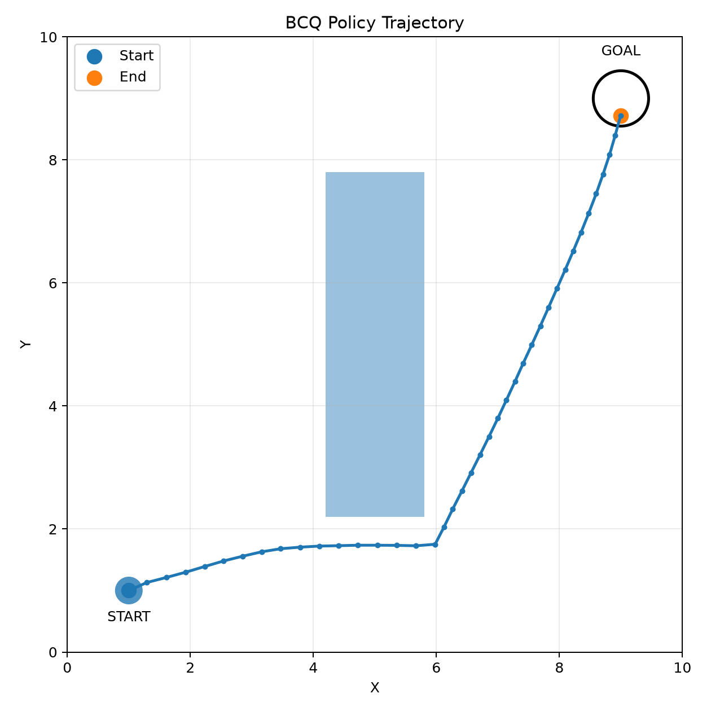
</p>

---

## 1. Why BCQ?

Standard off-policy value-based methods can behave poorly in the offline setting because the learned policy may select actions that are poorly represented in the dataset. The critic can assign unrealistically high values to such out-of-distribution actions, and the policy can exploit those errors.

**Batch-Constrained Q-Learning** addresses this problem by restricting action selection to actions that remain close to the behavior distribution represented by the offline dataset.

In this project, BCQ uses three neural components:

- a **conditional VAE** that models dataset actions conditioned on the state;
- a **perturbation actor** that makes only a small bounded modification to VAE-generated actions;
- a **double critic** that evaluates candidate actions and reduces value overestimation.

The learned policy therefore searches for high-value actions **inside or close to the support of the offline data**, instead of optimizing freely over the complete continuous action space.

---

## 2. Project Pipeline


A key design rule is that **the dataset is frozen before BCQ training begins**. Training batches are sampled only from `offline_dataset.npz`.

Periodic environment rollouts are used only for checkpoint selection and early stopping. They are never inserted into the replay dataset and never used directly for gradient updates.

---

## 3. Environment

The custom environment is a deterministic 2D continuous-control navigation problem implemented in `env.py`.

### Map

| Parameter | Value |
|---|---:|
| Map size | `10 x 10` |
| Start | `(1.0, 1.0)` |
| Goal | `(9.0, 9.0)` |
| Obstacle | rectangle `(4.2, 2.2) -> (5.8, 7.8)` |
| Agent radius | `0.15` |
| Goal radius | `0.45` |
| Maximum episode length | `120` steps |
| Maximum movement per step | `0.35` |

The central obstacle blocks the direct path between start and goal, so a useful policy must learn to navigate around it.

### State space

The state is a four-dimensional continuous vector:

```text
[x, y, goal_x - x, goal_y - y]
```

or mathematically

$$
s_t = [x_t, y_t, \Delta x_t, \Delta y_t].
$$

The first two components describe the agent position. The final two give the relative displacement from the current position to the goal.

### Action space

The action is a two-dimensional continuous vector:

$$
a_t = [a_x, a_y], \qquad a_x,a_y \in [-1,1].
$$

The environment converts it into movement using

$$
p_{t+1} = p_t + 0.35a_t.
$$

Actions are clipped to `[-1, 1]` before execution.

### Reward function

The dense reward is based on progress toward the goal:

$$
r_t = 5(d_t-d_{t+1}) - 0.02,
$$

where $d_t$ is the Euclidean distance from the agent to the goal.

Terminal modifications are:

- goal reached: `+10`;
- collision: `-5`;
- timeout: episode ends after `120` steps.

This reward encourages short, goal-directed trajectories while explicitly penalizing collisions.

---

## 4. Offline Dataset

The dataset is generated by `collect_dataset.py` before BCQ training.

The behavior controller follows one of two waypoint routes around the obstacle:

- lower route with probability `0.7`;
- upper route with probability `0.3`.

The nominal waypoint direction is deliberately corrupted by Gaussian noise:

$$
\epsilon \sim \mathcal{N}(0, 0.3^2),
$$

and with probability `0.05` the controller executes a completely random action.

This produces a dataset that is useful but imperfect: it contains successful trajectories, suboptimal actions, and collisions.

### Reference dataset run

The dataset used for the reported experiment contained:

| Statistic | Value |
|---|---:|
| Episodes | `1,000` |
| Transitions | `38,751` |
| Behavior success during collection | `81.0%` |
| Collision episodes | `190` |
| Timeout episodes | `0` |
| Mean collection reward | `55.646` |

Each transition has the form

```text
(state, action, reward, next_state, done)
```

and is stored in:

```text
data/offline_dataset.npz
```

Once this file is created, BCQ training does not collect additional training transitions.

---

## 5. BCQ Architecture

The implementation is split between `models.py` and `bcq.py`.

### 5.1 Conditional VAE

The VAE models the conditional behavior distribution

$$
p(a\mid s).
$$

The encoder receives the concatenated state and dataset action and maps them to a latent distribution:

$$
q_\phi(z\mid s,a).
$$

The decoder then reconstructs or samples a plausible action:

$$
\hat a = D_\theta(s,z).
$$

Architecture:

```text
Encoder:
(state + action) -> 256 -> ReLU -> 256 -> ReLU -> mean / log_std

Decoder:
(state + latent) -> 256 -> ReLU -> 256 -> ReLU -> tanh(action)
```

The latent dimension is `4`.

The training objective is

$$
\mathcal{L}_{VAE}
=
\operatorname{MSE}(\hat a,a)
+
0.5\,D_{KL}(q_\phi(z\mid s,a)\;||\;\mathcal{N}(0,I)).
$$

The purpose of the VAE is not to maximize return directly. It learns which actions are plausible under the fixed dataset.

### 5.2 Perturbation Actor

A VAE candidate is allowed to move only a small distance:

$$
\tilde a
=
\operatorname{clip}
\left(
 a + \Phi\tanh(\xi_\psi(s,a)),
 -1,
 1
\right),
$$

with

$$
\Phi = 0.05.
$$

The perturbation actor therefore improves candidate actions without allowing unrestricted movement away from the behavior distribution.

Architecture:

```text
(state + action) -> 256 -> ReLU -> 256 -> ReLU -> action perturbation
```

### 5.3 Double Critic

Two independent Q-functions are learned:

$$
Q_1(s,a), \qquad Q_2(s,a).
$$

Each critic has the architecture

```text
(state + action) -> 256 -> ReLU -> 256 -> ReLU -> scalar Q-value
```

The target evaluation combines the conservative minimum and optimistic maximum:

$$
Q_{mix}
=
0.75\min(Q_1',Q_2')
+
0.25\max(Q_1',Q_2').
$$

For every next state, the implementation samples `10` candidate next actions during training and chooses the candidate with the highest mixed target value.

The Bellman target is

$$
y
=
r+
\gamma(1-d)
\max_i Q_{mix}(s',\tilde a_i),
$$

with

$$
\gamma=0.99.
$$

The critic objective is

$$
\mathcal{L}_Q
=
(Q_1(s,a)-y)^2
+
(Q_2(s,a)-y)^2.
$$

### 5.4 Actor objective

The perturbation actor is optimized using

$$
\mathcal{L}_{actor}
=
-\mathbb{E}[Q_1(s,\tilde a)].
$$

Therefore, the actor loss commonly becomes **more negative** as the actor finds actions with larger predicted Q-values. It should not be interpreted like a conventional supervised loss that must approach zero.

### 5.5 Action selection

At inference time, the state is repeated `100` times. The VAE generates `100` candidate actions, the perturbation actor adjusts each one, and the critic selects

$$
a^*
=
\arg\max_i Q_1(s,\tilde a_i).
$$

This is the core batch-constrained decision rule used by the project.

---

## 6. Training Configuration

| Hyperparameter | Value |
|---|---:|
| Batch size | `256` |
| Maximum training steps | `100,000` |
| Learning rate | `1e-3` |
| Discount factor $\gamma$ | `0.99` |
| Soft target update $\tau$ | `0.005` |
| Perturbation limit $\Phi$ | `0.05` |
| VAE latent dimension | `4` |
| Target candidates per next state | `10` |
| Inference candidates | `100` |
| Random seed | `42` |

Target critic and target perturbation networks are updated by Polyak averaging:

$$
\theta' \leftarrow \tau\theta + (1-\tau)\theta'.
$$

### Early stopping

The policy is evaluated every `5,000` gradient steps on `30` episodes.

Model selection uses:

1. **success rate** as the primary metric;
2. **average reward** as the secondary metric when success is effectively tied.

Early stopping begins after step `10,000` with patience `2` evaluation rounds.

In the reported run:

| Step | Success | Average reward | Collision rate |
|---:|---:|---:|---:|
| 5,000 | 90% | 58.893 | 10% |
| **10,000** | **100%** | **64.399** | **0%** |
| 15,000 | 100% | 63.752 | 0% |
| 20,000 | 100% | 63.606 | 0% |

The best checkpoint was therefore selected at **10,000 steps**, while training terminated at **20,000 steps** after two evaluations without meaningful improvement.

<p align="center">
  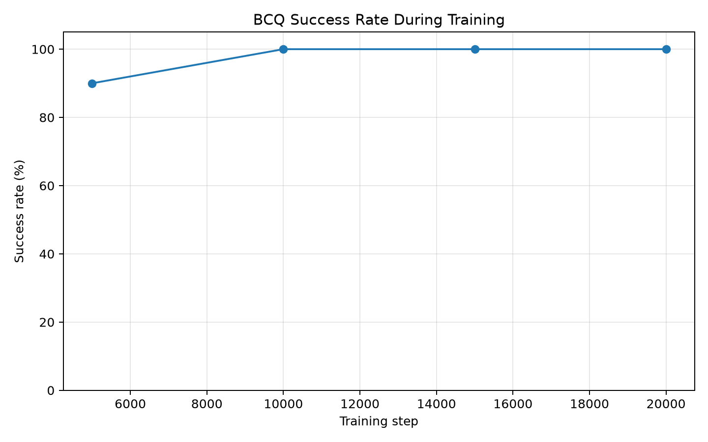
  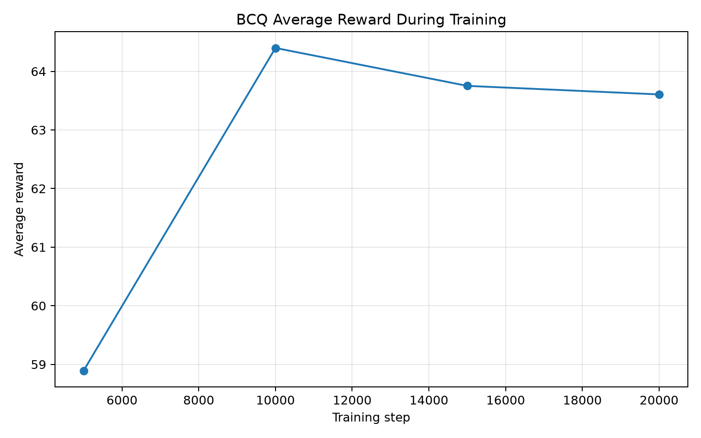
</p>

---

## 7. Training Diagnostics

The three optimization losses have different interpretations.

### VAE loss

Expected behavior: **decrease and then stabilize**.

The VAE reconstruction objective converged to approximately `0.10`, indicating that the conditional generative model had reached a stable reconstruction regime.

<p align="center">
  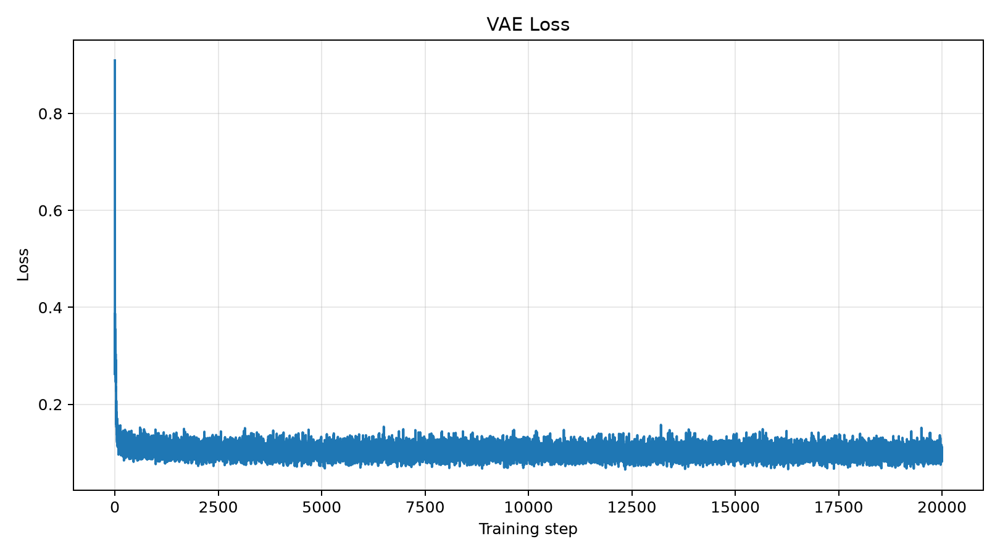
</p>

### Critic loss

Expected behavior: **fluctuation is normal**, because the Bellman target changes while the actor and target networks are also moving. The critical failure mode is persistent divergence or numerical explosion, not the absence of monotonic decrease.

In this experiment the critic loss increased during the early value-learning phase and then moved back toward a lower, stable regime.

<p align="center">
  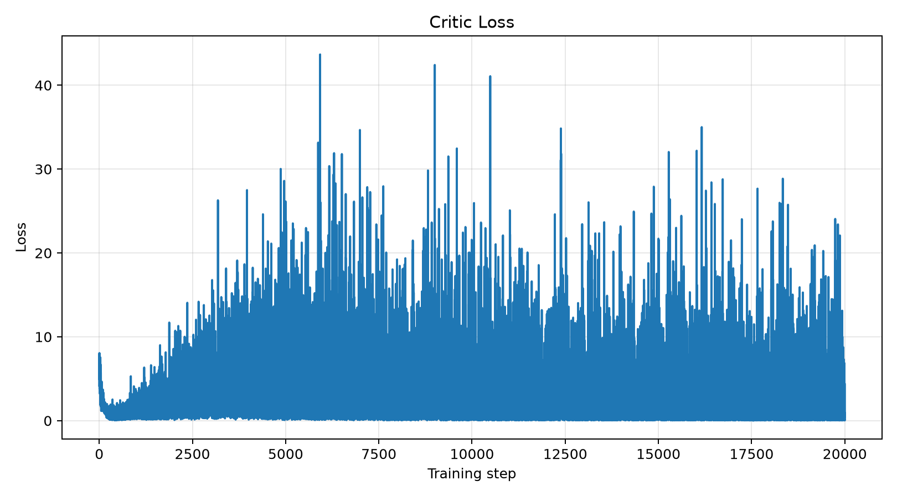
</p>

### Actor loss

Expected behavior: usually becomes **more negative** and then stabilizes because

$$
\mathcal{L}_{actor}=-Q_1(s,a).
$$

The actor loss reached a plateau around `-34`, which is consistent with stabilization of the learned Q-values and perturbation policy.

<p align="center">
  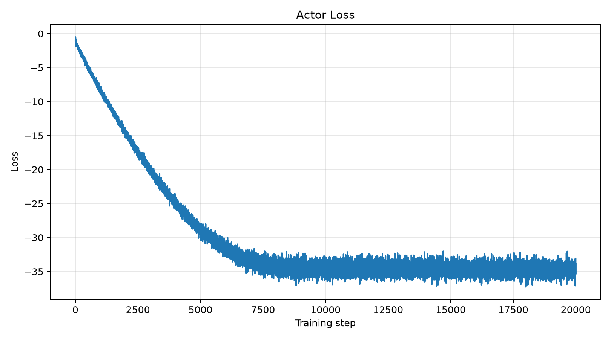
</p>

---

## 8. Final Evaluation

The final model is evaluated for `100` episodes and compared with two baselines:

- **Random** — uniformly sampled continuous actions;
- **Behavior** — the noisy waypoint policy used to generate the offline dataset;
- **BCQ** — the best offline-trained BCQ checkpoint.

### Results

| Policy | Success rate | Collision rate | Average reward | Reward std. | Average steps |
|---|---:|---:|---:|---:|---:|
| Random | 0% | 93% | -4.531 | 5.835 | 37.11 |
| Behavior | 76% | 24% | 53.165 | 20.132 | 37.19 |
| **BCQ** | **100%** | **0%** | **64.398** | **0.006** | **39.00** |

BCQ therefore achieves:

- **+24 percentage points** in success rate over the behavior policy;
- complete removal of collisions in this evaluation (`24% -> 0%`);
- a higher mean return (`53.165 -> 64.398`);
- dramatically lower return variance.

<p align="center">
  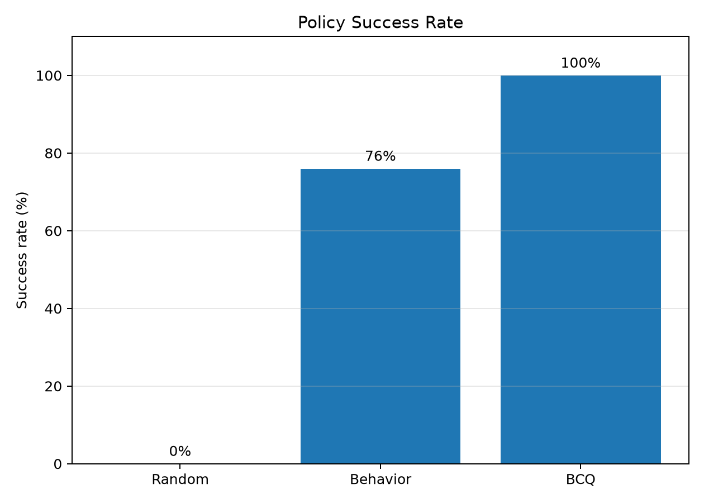
  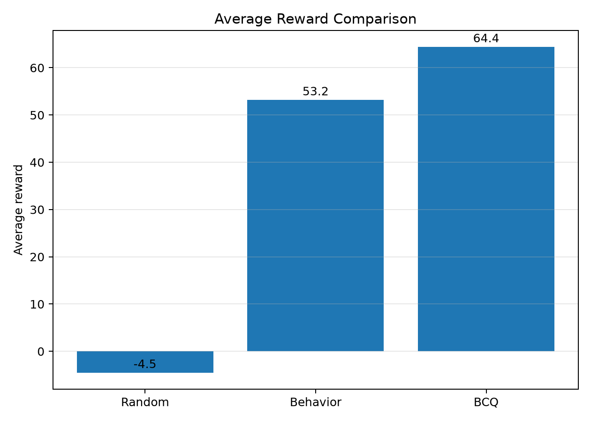
  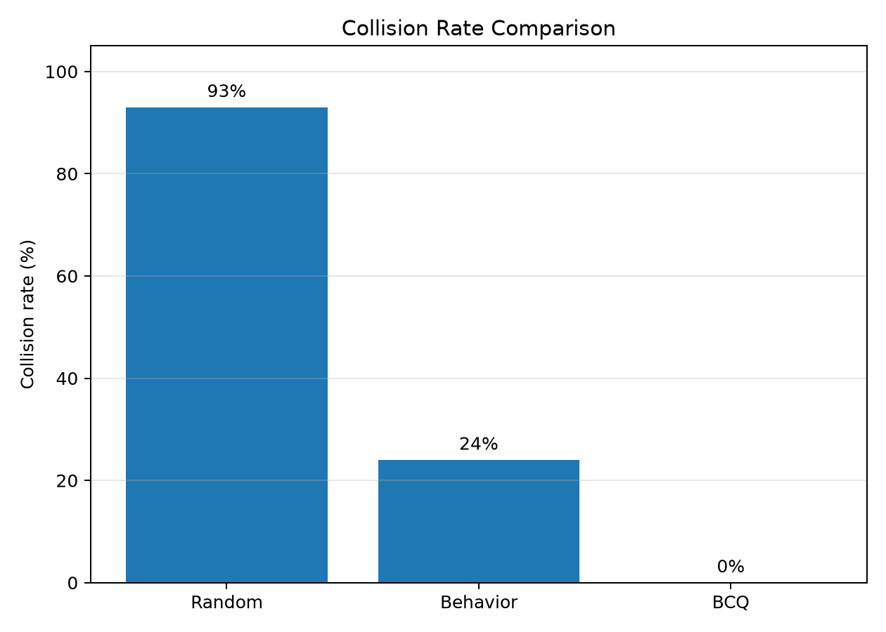
</p>

---

## 9. Policy Trajectories

### Random policy

The random controller has no navigation strategy and frequently collides with the map boundary or obstacle.

<p align="center">
  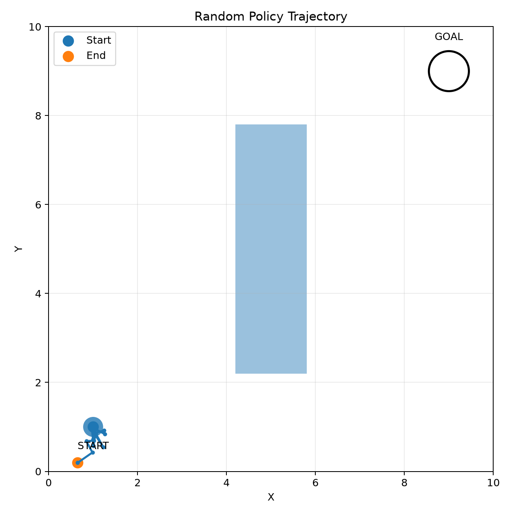
</p>

### Behavior policy

The behavior controller provides useful demonstrations, but noise and random exploration create collisions and inefficient decisions.

<p align="center">
  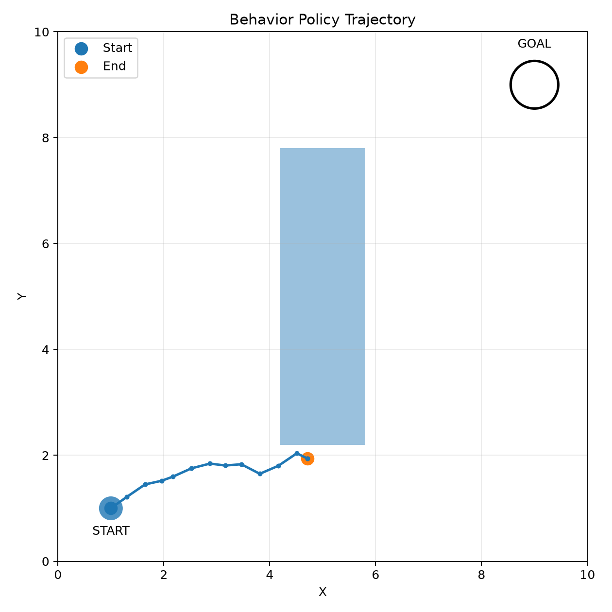
</p>

### BCQ policy

BCQ uses the support of the behavior dataset while choosing higher-value actions inside that constrained region. In the final experiment it consistently reaches the goal without collision.

<p align="center">
  
</p>

---

## 10. Repository Structure

```text
.
├── bcq.py                  # BCQ training step, action selection, save/load
├── collect_dataset.py      # Behavior policy and offline dataset generation
├── config.py               # Environment, BCQ, and experiment configuration
├── dataset.py              # Offline dataset loader and minibatch sampling
├── env.py                  # Continuous 2D navigation environment
├── evaluate.py             # Random / behavior / BCQ evaluation
├── models.py               # VAE, double critic, perturbation actor
├── train.py                # Offline training, checkpointing, early stopping
├── visualize.py            # Training and evaluation plots
│
├── data/
│   └── offline_dataset.npz # Generated by collect_dataset.py
│
├── checkpoints/
│   ├── bcq_best.pt         # Best evaluation checkpoint
│   └── bcq_final.pt        # Final exported best model
│
└── results/
    ├── evaluation_metrics.json
    ├── evaluation_trajectories.npz
    ├── training_history.npz
    ├── trajectory_random.png
    ├── trajectory_behavior.png
    ├── trajectory_bcq.png
    ├── policy_success_comparison.png
    ├── policy_reward_comparison.png
    ├── policy_collision_comparison.png
    ├── training_success_rate.png
    ├── training_average_reward.png
    ├── vae_loss.png
    ├── critic_loss.png
    └── actor_loss.png
```

`data/` and `checkpoints/` are generated during the pipeline and do not need to be committed if the repository is intended to remain lightweight.

---

## 11. Installation

Python `3.10+` is recommended.

Create a virtual environment and install the dependencies:

```bash
python -m venv .venv
```

Windows:

```bash
.venv\Scripts\activate
```

Linux / macOS:

```bash
source .venv/bin/activate
```

Install dependencies:

```bash
pip install numpy torch matplotlib
```

CUDA is optional. The code automatically uses CUDA when `torch.cuda.is_available()` is true; otherwise it runs on CPU.

---

## 12. Reproducing the Experiment

### 1. Generate the offline dataset

```bash
python collect_dataset.py
```

This creates:

```text
data/offline_dataset.npz
```

### 2. Train BCQ

```bash
python train.py
```

Training creates checkpoints and stores the full history in `results/training_history.npz`.

The best policy is restored before exporting:

```text
checkpoints/bcq_best.pt
checkpoints/bcq_final.pt
```

### 3. Evaluate all policies

```bash
python evaluate.py
```

This evaluates Random, Behavior, and BCQ policies and creates:

```text
results/evaluation_metrics.json
results/evaluation_trajectories.npz
```

### 4. Generate all plots

```bash
python visualize.py
```

All figures are written to `results/`.

### Optional smoke tests

Individual modules can also be executed directly:

```bash
python config.py
python env.py
python dataset.py
python models.py
python bcq.py
```

---

## 13. Offline-RL Interpretation

The important result is not simply that the final policy reaches the goal. The experiment demonstrates the specific motivation for BCQ.

The behavior policy generates imperfect but informative data. BCQ does not receive new training transitions after collection. Instead, it:

1. learns the conditional action distribution represented by the dataset;
2. samples actions from this learned support;
3. permits only small bounded perturbations;
4. uses Q-learning to select better actions among those constrained candidates.

This allows the final policy to outperform the policy that generated the data **without unrestricted exploration during training**.

---

## 14. Limitations

This repository is intentionally compact and designed to make the BCQ mechanism easy to inspect. The current experiment should therefore be interpreted as a controlled demonstration rather than a large-scale benchmark.

Current limitations include:

- one fixed map;
- one fixed start and goal location;
- a single rectangular obstacle;
- a low-dimensional state and action space;
- dataset coverage generated by only two waypoint families;
- no comparison yet against other offline RL algorithms such as CQL, IQL, or TD3+BC;
- environment rollouts are used for checkpoint selection, although evaluation transitions are never used for gradient updates.

For a stricter offline-learning protocol, checkpoint selection could be replaced by an offline policy evaluation method or a predefined fixed training budget.

---

## 15. Possible Extensions

Natural next experiments include:

- varying behavior-policy noise to create low-, medium-, and high-quality datasets;
- studying sensitivity to the perturbation limit $\Phi$;
- varying the number of candidate actions;
- randomizing start and goal positions;
- adding multiple obstacle layouts;
- comparing BCQ with Behavior Cloning;
- comparing BCQ with CQL, IQL, TD3+BC, or other offline RL baselines;
- evaluating robustness when the test environment differs from the data-collection environment.

These extensions would test not only whether BCQ solves the current map, but also how performance depends on **dataset quality, coverage, and distribution shift**.

---

## 16. Reference

The implementation follows the core idea of Batch-Constrained Q-Learning introduced in:

> Scott Fujimoto, David Meger, Doina Precup. **Off-Policy Deep Reinforcement Learning without Exploration.** ICML 2019.

Paper: https://arxiv.org/abs/1812.02900

---

## Summary

This project provides a compact reproducible BCQ experiment with a fully custom continuous-control environment and a real offline training pipeline.

The reference run produced the following progression:

```text
No policy knowledge
        ↓
Noisy behavior dataset: 38,751 transitions
        ↓
Offline BCQ training
        ↓
Best checkpoint at 10,000 gradient steps
        ↓
100% evaluation success
0% collisions
64.398 average reward
```

The experiment illustrates the central BCQ principle: **improve on the behavior policy while keeping the learned actions close to the support of the fixed offline dataset.**
