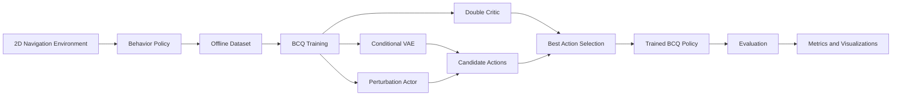

# Batch-Constrained Q-Learning for Offline 2D Navigation

A complete implementation of **Batch-Constrained Q-Learning (BCQ)** for a custom continuous-control navigation environment.

The project demonstrates a full offline reinforcement learning pipeline:

1. create a continuous 2D navigation environment;
2. collect a fixed offline dataset using an imperfect behavior policy;
3. train BCQ using only the collected dataset;
4. select the best model using evaluation and early stopping;
5. compare BCQ with Random and Behavior policies;
6. visualize trajectories, training dynamics, rewards, success rates, and collisions.

The trained BCQ policy achieved:

- **100% success rate**
- **0% collision rate**
- **64.398 average reward**

while the behavior policy used to generate the dataset achieved only **76% success** during final evaluation.

<p align="center">
  
</p>

---

## Project Pipeline



The most important constraint is that after the dataset has been created, **BCQ does not collect new training transitions from the environment**.

Training is performed entirely from the fixed offline dataset.

---

# Environment

The environment is implemented in `env.py`.

It is a deterministic 2D continuous-control navigation problem.

The agent starts in the lower-left part of the map and must reach the goal in the upper-right part while avoiding a large central obstacle.

<p align="center">
  
  
</p>

## Environment Parameters

| Parameter | Value |
|---|---:|
| Map size | `10 x 10` |
| Start position | `(1.0, 1.0)` |
| Goal position | `(9.0, 9.0)` |
| Obstacle | `(4.2, 2.2) -> (5.8, 7.8)` |
| Agent radius | `0.15` |
| Goal radius | `0.45` |
| Maximum movement per step | `0.35` |
| Maximum episode length | `120` |

---

## State Space

The environment state is a four-dimensional continuous vector:

```text
[x, y, goal_x - x, goal_y - y]
```

Mathematically:

$$
s_t =
[x_t,\ y_t,\ \Delta x_t,\ \Delta y_t]
$$

where:

- `x`, `y` are the current coordinates of the agent;
- `goal_x - x` is the horizontal distance to the goal;
- `goal_y - y` is the vertical distance to the goal.

State dimension:

```text
4
```

---

## Action Space

The action is a two-dimensional continuous vector:

$$
a_t = [a_x, a_y]
$$

with:

$$
a_x,a_y \in [-1,1]
$$

The environment updates the position using:

$$
p_{t+1}=p_t+0.35a_t
$$

Actions are clipped to the valid range before execution.

Action dimension:

```text
2
```

---

## Reward Function

The reward is primarily based on progress toward the goal.

Let:

$$
d_t
$$

be the distance to the goal before the action and:

$$
d_{t+1}
$$

the distance after the action.

The base reward is:

$$
r_t =
5(d_t-d_{t+1})-0.02
$$

This means:

- moving toward the goal produces positive reward;
- moving away produces negative reward;
- every step has a small penalty.

Additional terminal rewards are:

```text
Goal reached: +10
Collision:    -5
```

The episode terminates when:

- the agent reaches the goal;
- the agent collides with an obstacle or map boundary;
- the maximum number of steps is reached.

---

# Offline Dataset

The offline dataset is generated by:

```text
collect_dataset.py
```

The behavior policy is intentionally imperfect.

It approximately follows one of two waypoint routes around the obstacle and adds Gaussian noise to its actions.

The main route is selected with probability:

```text
0.7
```

and the alternative route with probability:

```text
0.3
```

The action noise is sampled from:

$$
\epsilon \sim \mathcal{N}(0,0.3^2)
$$

Additionally, with probability `0.05`, the behavior policy executes a completely random action.

This produces a dataset containing:

- successful trajectories;
- suboptimal movements;
- noisy actions;
- collisions.

Each transition has the form:

```text
(state, action, reward, next_state, done)
```

and is stored in:

```text
data/offline_dataset.npz
```

---

## Dataset Statistics

The generated dataset contains:

| Statistic | Value |
|---|---:|
| Episodes | `1,000` |
| Transitions | `38,751` |
| Successful episodes | `810` |
| Collision episodes | `190` |
| Timeout episodes | `0` |
| Success rate | `81.0%` |
| Average reward | `55.646` |

After this dataset is generated, it is frozen.

BCQ does not add new transitions during training.

---

# BCQ Algorithm

The BCQ implementation consists of three neural components:

1. **Conditional VAE**
2. **Perturbation Actor**
3. **Double Critic**

The main implementation is located in:

```text
models.py
bcq.py
```

---

# Conditional VAE

The VAE learns which actions are likely to appear in the offline dataset for a given state.

Instead of allowing BCQ to freely generate arbitrary continuous actions, the VAE produces candidate actions that resemble the behavior represented in the dataset.

The encoder receives:

```text
state + action
```

and produces a latent distribution.

Architecture:

```text
(state + action)
        |
       256
        |
      ReLU
        |
       256
        |
      ReLU
       / \
    mean log_std
```

The decoder receives:

```text
state + latent vector
```

and reconstructs an action:

```text
(state + latent)
        |
       256
        |
      ReLU
        |
       256
        |
      ReLU
        |
      tanh
        |
      action
```

The latent dimension is:

```text
4
```

The VAE objective combines action reconstruction and KL regularization:

$$
L_{VAE}
=
L_{reconstruction}
+
0.5L_{KL}
$$

The VAE does not directly optimize reward.

Its purpose is to model the action distribution contained in the offline dataset.

---

# Perturbation Actor

Using only VAE actions would make the policy behave too similarly to the original dataset.

BCQ therefore uses a perturbation network.

It receives:

```text
state + VAE action
```

and produces a small correction.

The corrected action is:

$$
\tilde{a}
=
a +
\Phi\tanh(\xi(s,a))
$$

where:

$$
\Phi=0.05
$$

The final action is clipped to:

$$
[-1,1]
$$

This allows BCQ to improve dataset actions while preventing large deviations from the behavior distribution.

Architecture:

```text
(state + action)
        |
       256
        |
      ReLU
        |
       256
        |
      ReLU
        |
  perturbation
```

---

# Double Critic

BCQ uses two Q-networks:

$$
Q_1(s,a)
$$

and

$$
Q_2(s,a)
$$

Each critic has the architecture:

```text
(state + action)
        |
       256
        |
      ReLU
        |
       256
        |
      ReLU
        |
     Q-value
```

Using two critics reduces the effect of Q-value overestimation.

During target calculation, the implementation combines both critics:

$$
Q_{mix}
=
0.75\min(Q_1,Q_2)
+
0.25\max(Q_1,Q_2)
$$

For each next state, BCQ generates multiple candidate actions and selects the one with the highest target value.

The Bellman target is:

$$
y =
r +
\gamma(1-d)
\max_i Q_{mix}(s',a_i)
$$

where:

$$
\gamma=0.99
$$

The critic loss is:

$$
L_Q =
(Q_1(s,a)-y)^2 +
(Q_2(s,a)-y)^2
$$

---

# Actor Optimization

The perturbation actor is trained to maximize the predicted Q-value.

The implemented loss is:

$$
L_{actor}
=
-\mathbb{E}[Q_1(s,\tilde a)]
$$

Because of the negative sign, the actor loss normally becomes **more negative** as the predicted Q-value increases.

Therefore:

```text
Actor loss becoming more negative is expected.
```

It should eventually stabilize rather than diverge indefinitely.

---

# BCQ Action Selection

During evaluation, BCQ generates:

```text
100 candidate actions
```

for every state.

The process is:

```text
Current State
     |
     v
Conditional VAE
     |
     v
100 Candidate Actions
     |
     v
Perturbation Actor
     |
     v
Modified Candidate Actions
     |
     v
Critic Q1
     |
     v
Action with Maximum Q-value
```

Formally:

$$
a^*
=
\arg\max_i Q_1(s,\tilde a_i)
$$

This is the key idea behind the batch constraint:

BCQ searches for a good action among actions that remain close to those represented by the offline dataset.

---

# Training Configuration

| Hyperparameter | Value |
|---|---:|
| Batch size | `256` |
| Maximum training steps | `100,000` |
| Learning rate | `0.001` |
| Discount factor | `0.99` |
| Target update coefficient | `0.005` |
| Perturbation limit | `0.05` |
| VAE latent dimension | `4` |
| Candidate actions during training | `10` |
| Candidate actions during evaluation | `100` |
| Random seed | `42` |

The target networks are updated using soft updates:

$$
\theta_{target}
\leftarrow
\tau\theta
+
(1-\tau)\theta_{target}
$$

with:

$$
\tau=0.005
$$

---

# Early Stopping

The policy is evaluated every:

```text
5,000 training steps
```

using:

```text
30 evaluation episodes
```

Model quality is determined primarily by:

1. success rate;
2. average reward.

Early stopping starts after:

```text
10,000 steps
```

with patience:

```text
2 evaluations
```

The training run produced:

| Step | Success Rate | Average Reward | Collision Rate |
|---:|---:|---:|---:|
| 5,000 | 90% | 58.893 | 10% |
| **10,000** | **100%** | **64.399** | **0%** |
| 15,000 | 100% | 63.752 | 0% |
| 20,000 | 100% | 63.606 | 0% |

The best checkpoint was obtained at:

```text
10,000 steps
```

Training stopped at:

```text
20,000 steps
```

because two consecutive evaluations failed to improve the best result.

The best model is stored in:

```text
checkpoints/bcq_best.pt
```

and exported as:

```text
checkpoints/bcq_final.pt
```

<p align="center">
  
  
</p>

---

# Training Dynamics

## VAE Loss

Expected behavior:

```text
decrease -> stabilize
```

The VAE loss converged to approximately:

```text
0.10
```

<p align="center">
  
</p>

---

## Critic Loss

The critic loss does not need to decrease monotonically.

Its targets change during training because:

- target networks are updated;
- the actor changes;
- candidate actions change;
- Q-values themselves evolve.

The important requirement is that the critic remains numerically stable.

During the experiment, the critic loss initially increased and later decreased into a more stable region.

<p align="center">
  
</p>

---

## Actor Loss

Because:

$$
L_{actor}=-Q_1
$$

the actor loss is expected to become more negative while the policy improves.

In this experiment it eventually stabilized around:

```text
-34
```

<p align="center">
  
</p>

---

# Final Evaluation

The final BCQ model was compared against:

### Random Policy

Actions are sampled uniformly from the continuous action space.

### Behavior Policy

The same noisy waypoint controller used to create the offline dataset.

### BCQ Policy

The best model obtained during offline training.

Each policy was evaluated for:

```text
100 episodes
```

---

## Results

| Policy | Success Rate | Collision Rate | Average Reward | Reward Std | Average Steps |
|---|---:|---:|---:|---:|---:|
| Random | 0% | 93% | -4.531 | 5.835 | 37.11 |
| Behavior | 76% | 24% | 53.165 | 20.132 | 37.19 |
| **BCQ** | **100%** | **0%** | **64.398** | **0.006** | **39.00** |

BCQ improved the behavior policy from:

```text
76% -> 100% success
```

and reduced collisions from:

```text
24% -> 0%
```

Average reward increased from:

```text
53.165 -> 64.398
```

<p align="center">
  
  
  
</p>

---

# Policy Trajectories

## Random Policy

The random policy has no navigation strategy and usually collides with the obstacle or environment boundary.

<p align="center">
  
</p>

---

## Behavior Policy

The behavior policy generally moves toward the goal but contains substantial action noise.

This creates both successful trajectories and collisions.

<p align="center">
  
</p>

---

## BCQ Policy

BCQ learns to select higher-value actions while remaining close to the action distribution represented in the offline dataset.

The final policy reaches the goal without collisions during the evaluation experiment.

<p align="center">
  
</p>

---

# Repository Structure

```text
RL_Project/
│
├── bcq.py
├── collect_dataset.py
├── config.py
├── dataset.py
├── env.py
├── evaluate.py
├── models.py
├── train.py
├── visualize.py
├── README.md
│
├── data/
│   └── offline_dataset.npz
│
├── checkpoints/
│   ├── bcq_10000.pt
│   ├── bcq_best.pt
│   └── bcq_final.pt
│
└── results/
    ├── actor_loss.png
    ├── critic_loss.png
    ├── evaluation_metrics.json
    ├── evaluation_trajectories.npz
    ├── policy_collision_comparison.png
    ├── policy_reward_comparison.png
    ├── policy_success_comparison.png
    ├── training_average_reward.png
    ├── training_history.npz
    ├── training_success_rate.png
    ├── trajectory_bcq.png
    ├── trajectory_behavior.png
    ├── trajectory_random.png
    └── vae_loss.png
```

---

# Files

### `env.py`

Implements the custom continuous 2D navigation environment.

### `collect_dataset.py`

Runs the noisy behavior policy and generates the fixed offline dataset.

### `dataset.py`

Loads the offline dataset and samples random minibatches.

### `models.py`

Contains:

- Conditional VAE
- Double Critic
- Perturbation Actor

### `bcq.py`

Implements the BCQ algorithm:

- VAE training;
- critic training;
- perturbation actor training;
- target-network updates;
- candidate action generation;
- action selection;
- model saving and loading.

### `train.py`

Runs offline BCQ training with:

- training statistics;
- policy evaluation;
- checkpointing;
- best-model selection;
- early stopping;
- numerical stability checks.

### `evaluate.py`

Compares:

- Random Policy;
- Behavior Policy;
- BCQ Policy.

It saves final metrics and trajectories.

### `visualize.py`

Generates all training and evaluation plots.

### `config.py`

Contains environment parameters, paths, BCQ hyperparameters, and experiment settings.

---

# Installation

Python 3.10+ is recommended.

Create a virtual environment:

```bash
python -m venv .venv
```

Activate it on Windows:

```bash
.venv\Scripts\activate
```

Install dependencies:

```bash
pip install numpy torch matplotlib
```

The project automatically uses CUDA when available. Otherwise, it runs on CPU.

---

# Running the Project

## 1. Generate the Offline Dataset

```bash
python collect_dataset.py
```

Output:

```text
data/offline_dataset.npz
```

---

## 2. Train BCQ

```bash
python train.py
```

Outputs include:

```text
checkpoints/bcq_best.pt
checkpoints/bcq_final.pt
results/training_history.npz
```

---

## 3. Evaluate the Policies

```bash
python evaluate.py
```

Outputs:

```text
results/evaluation_metrics.json
results/evaluation_trajectories.npz
```

---

## 4. Generate Visualizations

```bash
python visualize.py
```

The generated plots are stored in:

```text
results/
```

---

# Result

The experiment demonstrates that BCQ can improve an imperfect behavior policy using only a fixed offline dataset.

The complete pipeline is:

```text
Custom Environment
        |
        v
Noisy Behavior Policy
        |
        v
38,751 Offline Transitions
        |
        v
BCQ Offline Training
        |
        v
Best Model at 10,000 Steps
        |
        v
100% Success Rate
0% Collision Rate
64.398 Average Reward
```

The key result is that the final BCQ policy performs better than the policy that generated its training data while remaining constrained by the action distribution contained in that data. 